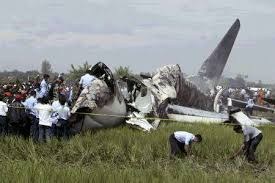
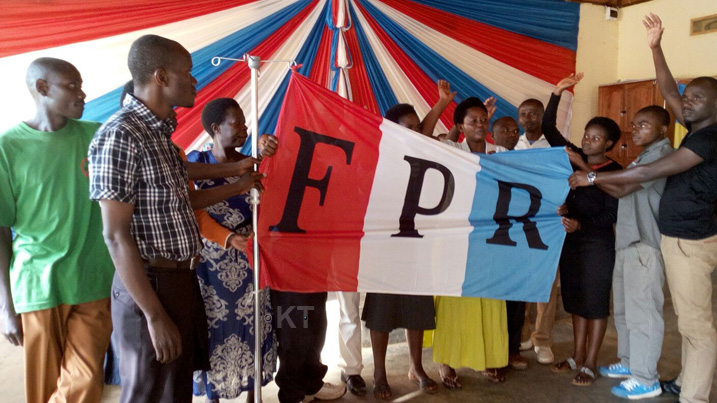
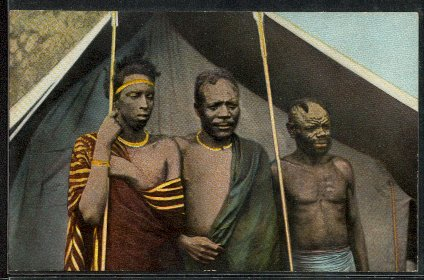
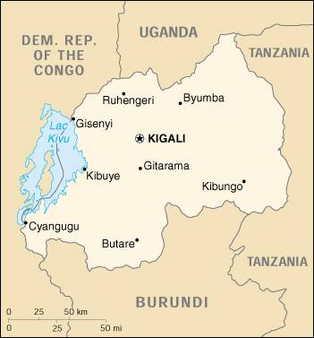
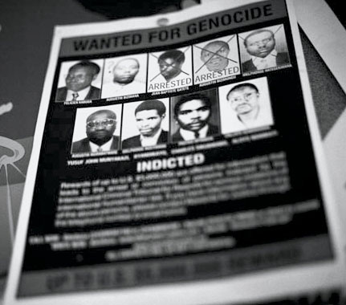
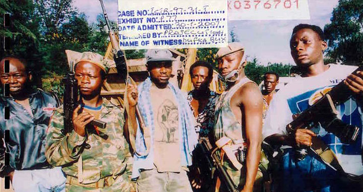

# Génocide des Tutsi du Rwanda

**I/ Les origines historiques et intellectuelles du problème ethnique**

A- Le « catégories » hutu, tutsi et twa

B- L’ethnicisation coloniale des Bahutu et Batutsi

C- L’indépendance et la recrudescence du racisme

**II/ Le génocide, de la planification à la réalisation**

A- Les ambiguïtés du gouvernement Habyarimana \(1973-1994\)

B- Le scenario des massacres

**III/ Justice et responsabilités**

A-Les responsabilités extérieures

B-Un Tribunal Pénal International pour le Rwanda \(TPIR\)

