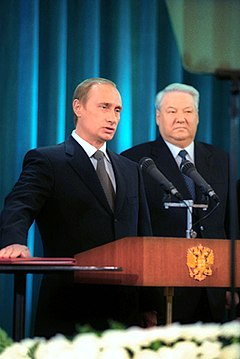
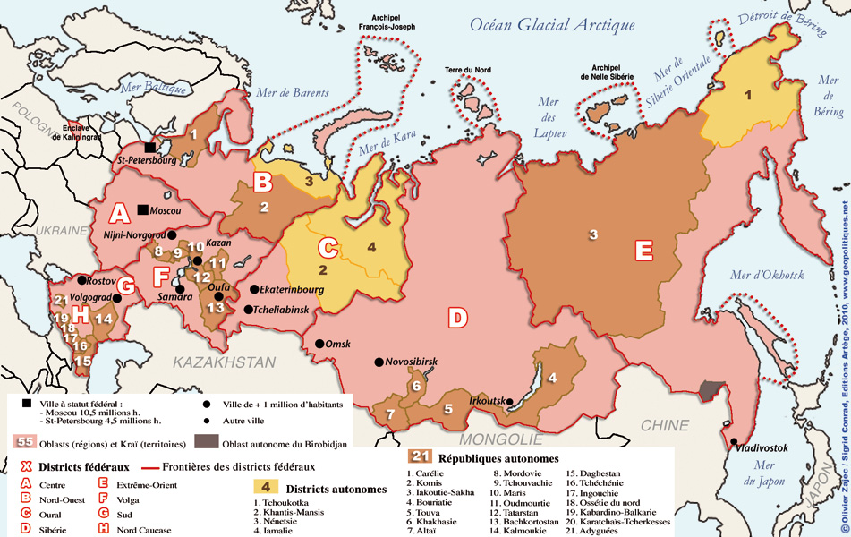
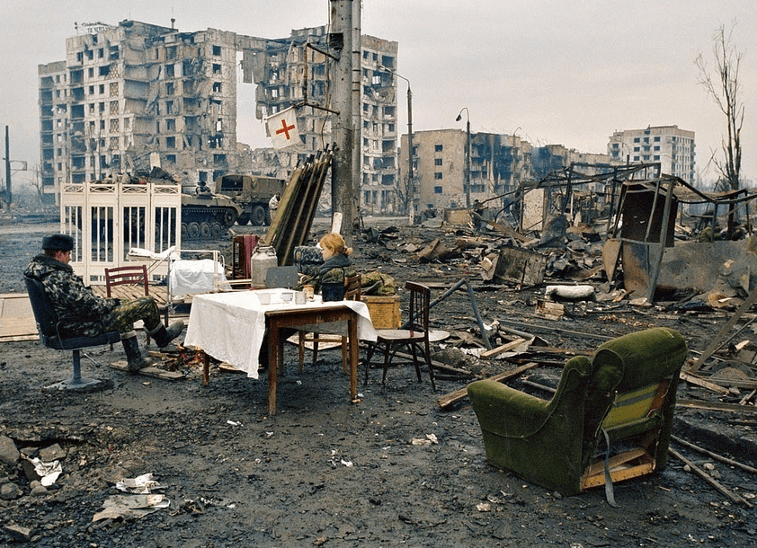
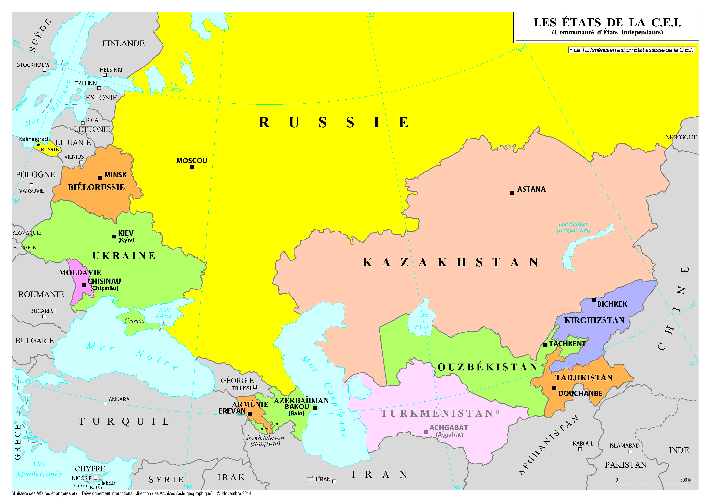

# La Fédération de Russie, de Eltsine à Poutine 1991-2003

**I/ Atouts et faiblesses de la nouvelle Fédération de Russie**

A-Une puissance internationale en déclin  
B-Les difficultés internes  
C-La Fédération de Russie reste une puissance internationale importante

**II/La politique étrangère russe sous Eltsine**

A-La crise d’identité : vers une redéfinition de la politique étrangère  
B-1991-1993 : la lune de miel avec l’Occident

**III/ La première présidence de Vladimir Poutine \(2000-2004\) : le retour officiel à une politique de force**

A-Le régime Poutine : « la verticale du pouvoir »  
B-Le retour de la Russie sur la scène internationale  
C-L’appel à un monde multipolaire

